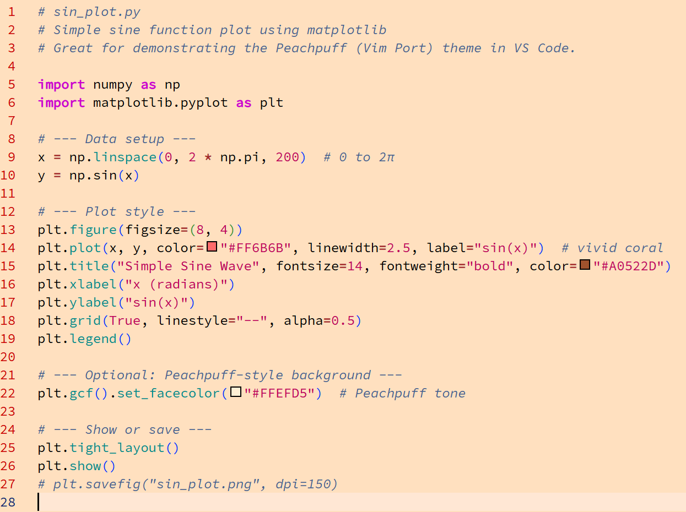

# Peachpuff (Vim Port)

A bright, elegant, and nostalgic **color theme for Visual Studio Code**,  
faithfully ported from the classic **Vim “Peachpuff”** scheme by *David Nečas (Yeti)*.  
Perfect for users who enjoy a soft light background with warm contrast and a vintage charm.

<p align="center">
  
</p>
---

## ✨ Features

* Faithful recreation of the original **Vim Peachpuff** color palette
* Gentle peach background (`#FFEFD5`) ideal for long coding sessions
* Clear syntax contrast for Python, Markdown, HTML, and more
* Warm, balanced tones for eyestrain-free readability
* Vintage aesthetic with a modern touch

---

## 🧩 Installation

You can install **Peachpuff (Vim Port)** in two ways:

### 1. From the VS Code Marketplace

Search for:

```
Peachpuff (Vim Port)
```

or visit the Marketplace page directly:
👉 [https://marketplace.visualstudio.com/items?itemName=r11s.peachpuff](https://marketplace.visualstudio.com/items?itemName=r11s.peachpuff)

### 2. Manual installation

1. Download the latest `.vsix` file from the [Releases](https://github.com/r11s/peachpuff-vscode/releases) page.
2. In VS Code, open the **Command Palette** (`Ctrl+Shift+P` or `Cmd+Shift+P`) and run:

   ```
   Extensions: Install from VSIX...
   ```
3. Select the downloaded file — done!

---

## 🖌️ Color Highlights

| Scope                 | Color     | Description     |
| --------------------- | --------- | --------------- |
| **Background**        | `#FFEFD5` | Peachpuff tone  |
| **Strings**           | `#C00058` | Deep pink-red   |
| **Comments**          | `#406090` | Muted blue      |
| **Keywords**          | `#A0522D` | Brown tone      |
| **Functions / Types** | `#2E8B57` | Seagreen accent |
| **Specials**          | `#6A5ACD` | Slate blue      |

---

## 🧠 About the Original

> The original *Peachpuff* color scheme was created by **David Nečas (Yeti)** for Vim (2003).
> This Visual Studio Code theme preserves its gentle, warm appearance while adapting it
> to modern editors and displays.

Ported and adapted by **Rainer S. (r11s)**.

---

## 📜 License

This project is released under the **Vim License**.
See the [LICENSE](LICENSE) file for full terms.

> © 2025 Rainer S.
> Based on the original work *peachpuff.vim* by David Nečas (Yeti)

---

## ❤️ Acknowledgements

* Original Vim color scheme: [peachpuff.vim](http://trific.ath.cx/Ftp/vim/colors/peachpuff.vim)
* Vim project and community for keeping a legendary editor alive
* Inspired by the simplicity and warmth of classic color palettes

---

## 🧡 Support Vim’s Charityware Idea

Vim is Charityware — you can support its development through the
**ICCF Holland Foundation**:
👉 [https://www.vim.org/iccf/](https://www.vim.org/iccf/)


